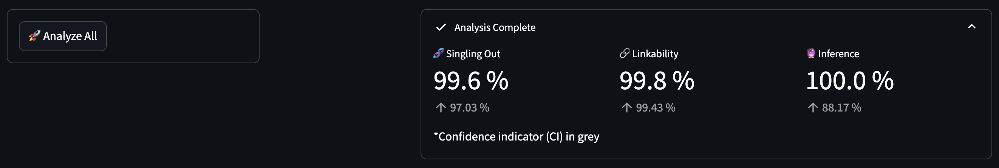
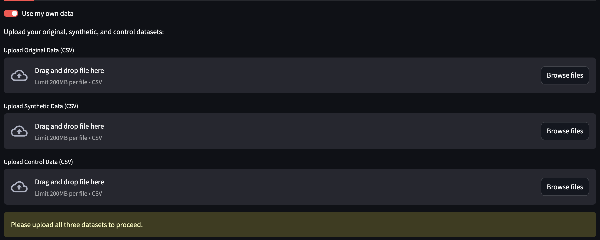
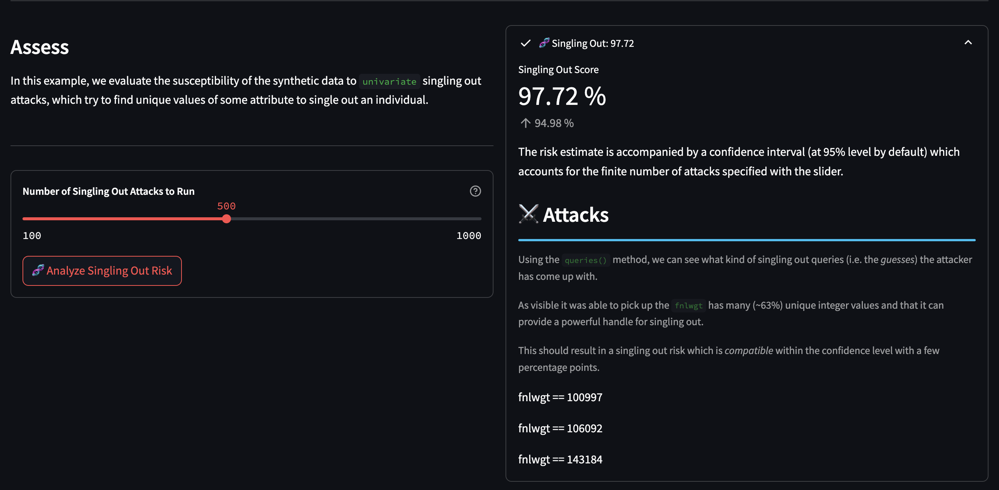

# Evaluating Synthetic Data Risk with Anonymeter

This Streamlit app was developed as a **proof of concept** to demonstrate how the **Anonos SDK** can be integrated with **Snowflake** to enable privacy-preserving analytics using synthetic data.

## Overview

The app showcases how to:

- **Leverage the Anonos Python SDK within a Snowflake environment** via user-defined functions (UDFs).
- **Generate synthetic data** directly in Snowflake using the SDK.
- **Analyze privacy risks** associated with the synthetic dataset using the open-source tool **Anonymeter**.

## Privacy Risk Analysis with Anonymeter

The core of this proof of concept is the [**Anonymeter**](https://github.com/statice/anonymeter), a library designed to evaluate privacy risks in synthetic datasets.

> **_Anonymeter_** contains privacy evaluators to measure the risks of singling out, linkability, and inference attacks that may be carried out against a synthetic dataset.  
> These risks are the three key indicators of factual anonymization according to the [European General Data Protection Regulation (GDPR)](https://gdpr-info.eu/).

For more details on the methodology behind Anonymeter, please refer to the paper by M. Giomi et al.:  
📄 [Assessing the Privacy Guarantees of Synthetic Data](https://petsymposium.org/popets/2023/popets-2023-0055.php)

---

## Key Technologies

- **Streamlit** – UI layer for interaction and visualization
- **Anonos SDK** – Synthetic data generation and risk analysis tools
- **Snowflake** – Cloud data platform with Python UDF support
- **Anonymeter** – Privacy risk evaluation for synthetic datasets

## Getting Started

### Streamlit UI

The descriptions in the app will closely follow the Jupyter Notebook example from the Anonymeter repository. As the application doesn't adhere to the sequential nature of a notebook, there are a few key changes made to make the UI a little more flexible:

1. **Analyze All**
At the top, you can use this button to run all three risk assessments on the default `adults` dataset. This will give you a high-level report of the overall scores for each in the top-right corner of the screen.



2. **Use Your Own Data*
On the `Datasets` tab, toggling this will allow you to drag in your own CSV datasets and analyze them. The `aux_cols` for the Linkability assessment will update according to your dataset and will need to be re-evaluated before running a new assessment. 



3. **Standalone Assessments**
Each assessment type has its own tab with unique parameters that can be adjusted and run individually. As seen here with Singling Out, this will give you more specifics on the outcome.




### Local Development

1. Ensure that you have installed Python `3.8.x`, `3.9.x`, or `3.10.x`
2. Install the required libraries: 
    ```shell
    pip install -r requirements.txt
    ```
3. Run the app:
    ```shell
    streamlit run app.py
    ```

### Docker

If you have Docker and Docker Compose installed, you can build and start the app at port `8501` with:

```shell
docker compose up -d
```

---

## License

This project is for demonstration purposes only and is not intended for production use.

---
